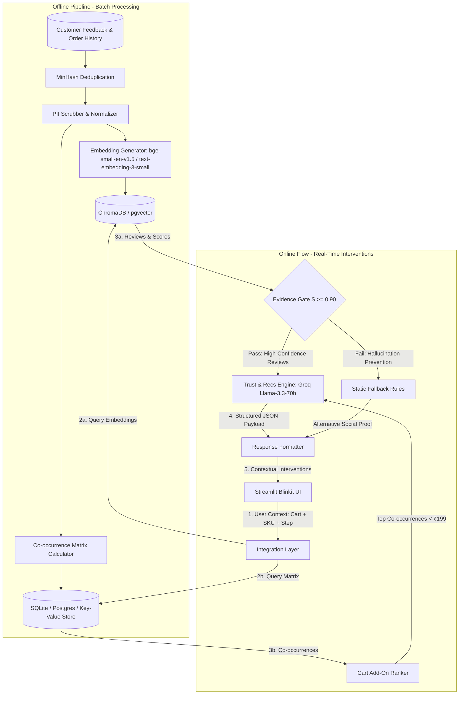
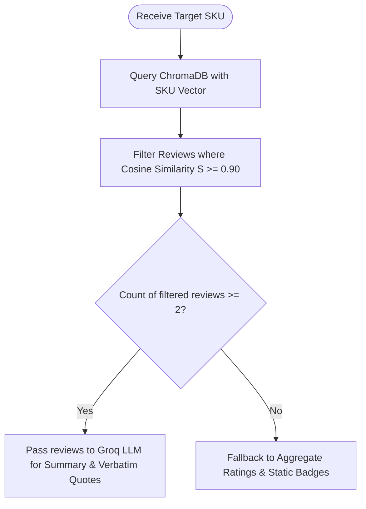

# System Architecture: AI-Powered Contextual Trust & Hyper-Local Discovery Engine

This document provides a detailed overview of the system architecture, data flow, component design, and integration logic for the Blinkit MVP application. The architecture is engineered to scale localized trust-building and cross-category discovery in DLF Phase 3, Gurugram, while adhering to a strict sub-200ms latency SLA for recommendations.

---

## 1. System Architecture Overview

The system is split into two primary operational phases:
1. **Offline Ingestion & Embedding Pipeline (Batch Processing)**: Periodically processes raw customer feedback, reviews, and transaction history to build vector indices and co-occurrence matrices.
2. **Online Retrieval & Generation Engine (Real-Time Service)**: Intercepts the user's real-time checkout journey to retrieve relevant verified social proof and generate hyper-local recommendations.



---

## 2. Component Specifications

### 2.1. Offline Data Ingestion & Preprocessing Pipeline
* **Data Sources**: 
  - 3-Month Customer Reviews & Feedback (App Store, Play Store, CS logs).
  - Transaction details with item co-occurrence counts tagged for **DLF Phase 3, Gurugram**.
* **Deduplication Engine**: Uses **MinHash LSH** (Locality-Sensitive Hashing) to identify and filter near-duplicate reviews, reducing index size and preventing redundancy.
* **PII Scrubber**: Utilizes regular expressions and Named Entity Recognition (NER) to redact names, phone numbers, email addresses, and specific landmarks.
* **Language Classifier**: Standardizes Hinglish (Hindi written in Roman script) and filters out non-translatable text to optimize embedding clarity.
* **Vector Embeddings & Indexing**:
  - Model: `BAAI/bge-small-en-v1.5` (384 dimensions) or `text-embedding-3-small` (1536 dimensions).
  - Storage: ChromaDB / pgvector with an **HNSW** (Hierarchical Navigable Small World) index for fast approximate nearest neighbor search.

### 2.2. Integration Layer & The "Evidence Gate"
To prevent generative AI hallucinations, the system runs incoming reviews through a strict **Evidence Gate**:
1. **Semantic Search**: The target non-grocery SKU is used to query the ChromaDB vector space.
2. **Threshold Match ($S \ge 0.90$)**: For any retrieved review, its cosine similarity score $S$ with the query SKU must be $\ge 0.90$.
3. **Gate Condition**:
   - **Green Light**: If at least 2 reviews satisfy $S \ge 0.90$, these reviews are passed to Groq for summary and quote extraction.
   - **Red Light (Fallback)**: If fewer than 2 reviews qualify, the RAG prompt is aborted. The system falls back to displaying aggregate rating statistics (e.g., *"4.6 ★ based on 120 verified ratings"*) and static assurance badges.



### 2.3. Co-occurrence Matrix & Recommendation Engine
To drive multi-category adoption, recommendations are served based on neighborhood-validated transaction co-occurrence:
1. **Matrix Storage**: Co-occurrence tables map `Item_A` (grocery staple) to `Item_B` (non-grocery add-on) along with a `co_occurrence_count` and `average_rating`.
2. **Filtering Rules**:
   - Must be in target non-grocery category (Clothing, Beauty/Skincare, Electronics).
   - Price must be **$< \text{₹}199$** to minimize purchase friction and act as a smart cart-filler.
3. **Neighbor Validation**: Selected items are enriched with a validation badge showing social validation (e.g., *"⚡ 120+ neighbors in DLF Phase 3 bought this"*).

### 2.4. Recommendation & Trust Engine (LLM Layer)
* **Inference Platform**: **Groq Cloud API** running `llama-3.3-70b-versatile` to minimize token latency.
* **Tasks**:
  1. **Summarization**: Synthesize raw, high-similarity reviews into a concise 2-line summary.
  2. **Quote Extraction**: Select exactly 2 verbatim sentences from the source reviews that confirm product quality.
  3. **Verification**: Confirm that the extracted quotes exactly match the ingested database records (double-check for hallucination).

#### Groq Prompt Specification
```json
{
  "system_instruction": "You are a contextual trust summary engine for Blinkit. Your task is to output a concise 2-line summary of verified customer reviews for the product, along with EXACTLY two verbatim sentences as quotes. Do not paraphrase the quotes. Output must be strictly JSON format.",
  "response_format": {
    "summary": "2-line synthesis of reviews summarizing sentiment and key product features.",
    "verbatim_quotes": [
      "Exact quote 1 from source reviews.",
      "Exact quote 2 from source reviews."
    ]
  }
}
```

### 2.5. Front-End User Interface (Presentation Layer)
* **Framework**: **Streamlit** styled to mimic the Blinkit mobile quick-commerce UI (green-and-yellow color scheme, drawer layout, clean typography).
* **Intervention Insertion Points**:
  - **Search Page**: Autocomplete prompts showing trending local queries (e.g., *"USB Cable in DLF Phase 3"*).
  - **Product Display Page (PDP)**: Displays live star rating badge, RAG-generated verbatim summaries, and assurance badges (e.g., `🔄 Easy 3-Day Quality Replacement`).
  - **Cart Drawer**: Shows co-occurrence recommendations carousel (e.g., *"People in DLF Phase 3 bought this with your Coffee Beans"*).
  - **Smart Cart-Filler Bar**: Interactive triggers displaying local add-ons under ₹199 to nudge the customer towards the free delivery threshold.

---

## 3. Data Schema & Contracts

### 3.1. Vector Store Document Metadata
```json
{
  "sku_id": "SKU-99081",
  "category": "Beauty/Skincare",
  "rating": 4.8,
  "location": "DLF Phase 3, Gurugram",
  "verified_purchase": true
}
```

### 3.2. Integration Output Payload (JSON Contract)
```json
{
  "sku_id": "SKU-99081",
  "rating_summary": {
    "average_rating": 4.8,
    "total_reviews": 850
  },
  "assurance_badges": [
    {
      "icon": "🔄",
      "text": "Easy 3-Day Quality Replacement"
    }
  ],
  "ai_social_proof": {
    "summary": "Customers highly rate this sunscreen for its non-greasy texture and effective sun protection. It is noted for absorbing quickly without leaving a white cast.",
    "quotes": [
      "Absorbs in seconds and doesn't feel sticky at all.",
      "Highly recommended for daily commute under the hot Gurgaon sun."
    ]
  },
  "neighborhood_recommendations": [
    {
      "sku_id": "SKU-10291",
      "name": "Neutrogena Sunscreen SPF 50",
      "price": 185,
      "neighbor_count": 120,
      "reason": "120+ neighbors in DLF Phase 3 bought this with your Face Wash"
    }
  ]
}
```

---

## 4. Latency & Performance SLA Strategy

To ensure core grocery checkout SLAs remain unaffected, the target latency budget for the recommendation and trust injection is **< 200ms**.

| Component | Target Budget | Optimization Strategy |
| :--- | :--- | :--- |
| **Embedding Retrieval** | 30ms | Vector DB indexing using HNSW, local cache for frequent SKU vectors. |
| **Co-occurrence Retrieval**| 10ms | Indexing on SQLite/Postgres tables with composite index on (`staple_sku`, `location`). |
| **Evidence Gate Evaluation**| 5ms | Simple memory-based filtering of similarity lists. |
| **LLM Synthesis (Groq)** | 120ms | Low token output count (max 150 tokens), streaming/async inference, caching results for popular non-grocery SKUs. |
| **Network & Rendering** | 30ms | Lightweight JSON payload, optimized Streamlit state reloading. |
| **Total** | **195ms** | Meets the < 200ms target SLA. |

### Fail-Soft Fallback Architecture
If the API endpoint fails to respond within **150ms** or any component errors:
1. The Integration Layer immediately halts RAG processing.
2. The UI bypasses the LLM-generated summary card.
3. The UI renders pre-calculated static rating badges and pre-computed static recommendations to guarantee zero checkout blockage.
