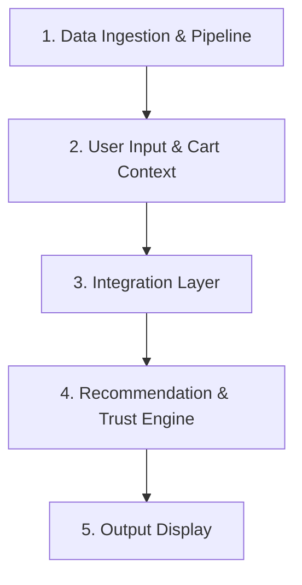

# AI-Powered Contextual Trust & Hyper-Local Discovery Engine (Blinkit Use Case)

You are tasked with building an AI-powered contextual trust and hyper-local recommendation service inspired by Blinkit's quick-commerce multi-category expansion challenge. The system should intelligently inject verified social proof, verbatim review summaries, and hyper-local co-occurrence recommendations into Blinkit's standard 7-step shopping flow:

`Open App` ➔ `Search` ➔ `Add to Cart` ➔ `View Cart` ➔ `Apply Coupon` ➔ `Payment` ➔ `Place Order`

This aims to break the single-category "grocery replenishment" mental model without compromising the 10-minute delivery speed.

---

## Objective

Design and implement a functional MVP application that:

1. **Data Ingestion & Processing**: Ingests and indexes localized customer feedback and order co-occurrence data specifically for **DLF Phase 3, Gurugram**.
2. **Product Page Interventions**: Surfaces live star ratings, assurance badges, and RAG-generated verbatim review summaries on non-grocery Product Display Pages (PDPs) for low-penetration categories (*Clothing, Beauty/Skincare, Electronics*).
3. **Hyper-Local Recommendations**: Leverages dense vector search and a Large Language Model (LLM) to generate personalized, neighborhood-validated cart recommendations (*"People in DLF Phase 3 buy this with your cart items"*) and smart cart-fillers ($< \text{₹}199$).
4. **Interactive UI**: Displays clear, contextual, and high-trust results directly within an interactive quick-commerce user interface.

---

## Target Metric

* **Multi-Category Penetration**: Increase the percentage of Monthly Active Customers (MAC) purchasing from $\ge 2$ super-categories from **28% to 45%+**.
* **Performance**: Maintain **sub-200ms** cart recommendation latency while preserving core grocery checkout SLAs.

---

## System Workflow

### 1. Data Ingestion & Pipeline
* **Collection**: Scrape and collect 3 months of customer feedback, App Store/Play Store reviews, and localized order trends tagged specifically for the **DLF Phase 3, Gurugram** dark-store catchment cluster.
* **Preprocessing**: Run MinHash deduplication, text normalization, language filtering (English/Hinglish), and PII scrubbing (phone numbers, addresses, account IDs).
* **Indexing**: Generate dense vector embeddings using `BAAI/bge-small-en-v1.5` / `text-embedding-3-small` and index them in ChromaDB / pgvector using HNSW indexing for rapid semantic retrieval.

### 2. User Input & Cart Context
Collect real-time user context across Blinkit's 7-step shopping flow:
* **Current Journey Step**: `Open App` ➔ `Search Item` ➔ `Add to Cart` ➔ `View Cart` ➔ `Apply Coupon` ➔ `Payment` ➔ `Place Order`.
* **Search / PDP Intent**: Active non-grocery product search queries (e.g., apparel, skincare, personal electronics).
* **Cart Contents**: Active items in cart (e.g., grocery staples like Coffee Beans or Face Wash).
* **Delivery Thresholds**: Remaining gap to hit free delivery or coupon minimums ($< \text{₹}199$).

### 3. Integration Layer
* **Review Retrieval**: Query dense vector index to pull relevant verified review records matching the target non-grocery SKU.
* **Evidence Gate**: Run Evidence Gate protocol ($S \ge 0.90$) to filter out low-confidence semantic matches and prevent generative hallucination.
* **Co-occurrence Retrieval**: Query DLF Phase 3 co-occurrence cluster matrices to retrieve complementary non-grocery SKUs ordered alongside cart staples by nearby neighbors.

### 4. Recommendation & Trust Engine
Leverage Groq (`llama-3.3-70b-versatile`) and Antigravity logic to:
* **Synthesize PDP Verbatim Reviews**: Generate concise 2-line AI review summaries backed by exactly 2 verbatim customer quotes for high-risk categories (apparel, electronics, skincare).
* **Rank Hyper-Local Cart Add-Ons**: Select and rank low-friction cart-fillers ($< \text{₹}199$) based on neighborhood co-occurrence strength in DLF Phase 3.
* **Surface Assurance Badging**: Automatically pair high-value items with verified protection badges (e.g., ⚡ *6-Month Official Warranty* or 🔄 *Easy 3-Day Quality Replacement*).

### 5. Output Display
Present structured, high-trust interventions directly within an interactive Streamlit UI simulating Blinkit's mobile app:
* **Product Display Page (PDP)**: Live Star Ratings (e.g., 4.7 ★ (850+)), AI Verbatim Summaries, and Assurance Badges.
* **Cart Drawer Carousel**: Hyper-local recommendation cards featuring neighbor validation (e.g., *"⚡ 120+ neighbors in DLF Phase 3 bought this with your Coffee Beans"*).
* **Smart Cart-Filler Bar**: Interactive add-on triggers allowing one-tap basket additions under ₹199.
